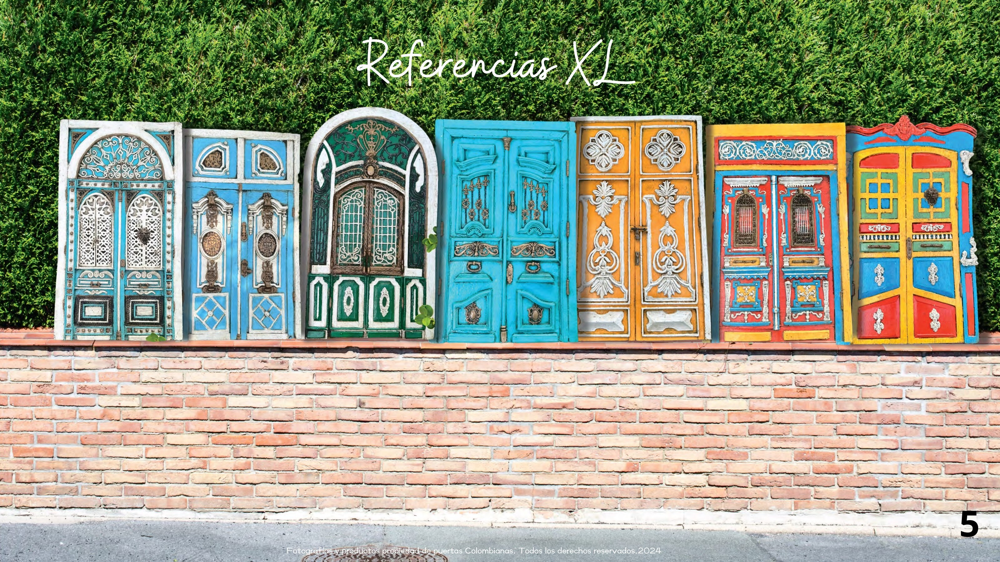
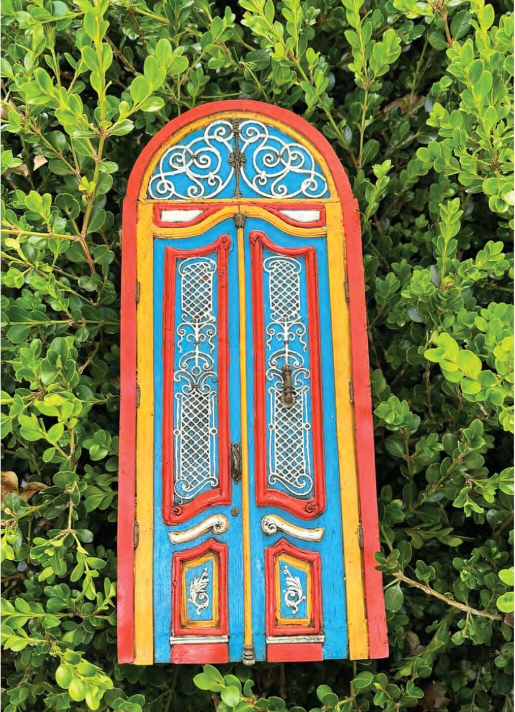
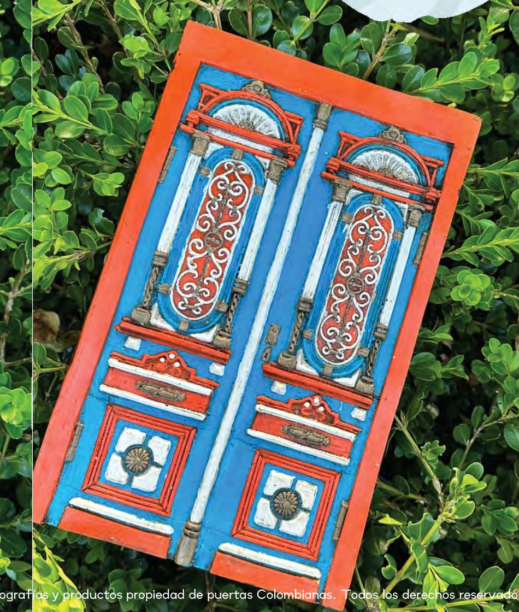
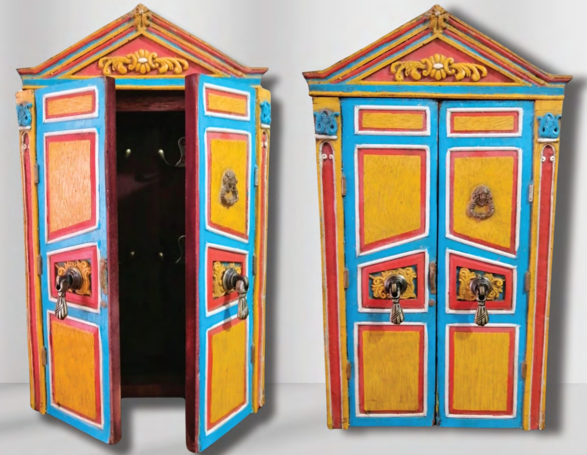

# 🚪 Puertas Colombia

<p align="center">
  
</p>

<p align="center">
  <strong>Arte · Color · Historia</strong>
</p>

<p align="center">
  Portal web tipo e-commerce para la marca <strong>Puertas Colombia</strong>, una empresa dedicada a crear piezas artesanales inspiradas en puertas, fachadas, portones, aldabas y elementos arquitectónicos tradicionales de Colombia.
</p>

<p align="center">
  
  
  
  
  
</p>

---

## 📌 Descripción del proyecto

**Puertas Colombia** es un portal empresarial y comercial desarrollado como proyecto final para la materia **Negocios en Internet**.

El sitio presenta una experiencia de compra inspirada en plataformas como **Amazon**, pero adaptada a una marca artesanal colombiana. El portal permite explorar productos, revisar detalles, agregar artículos al carrito, simular pagos, dejar comentarios y contactar a la empresa por redes sociales o WhatsApp.

El proyecto busca demostrar la viabilidad de una empresa virtual tipo startup, integrando comercio electrónico, marketing digital, herramientas colaborativas, redes sociales, catálogo de productos, validación con usuarios y una experiencia de compra completa.

---

## 🌎 Identidad de marca

**Puertas Colombia** nace con la idea de rescatar el valor histórico y cultural de las puertas tradicionales del país.

Cada pieza representa una parte de la arquitectura colombiana, inspirada en regiones como:

- Bogotá
- La Candelaria
- Usaquén
- Cartagena
- Mompox
- Barranquilla
- Girón
- Santa Marta
- Filandia
- Popayán
- Riohacha
- Salamina
- Santa Fe de Antioquia
- Granada
- Jardín
- Costa Caribe

La marca mezcla:

```text
Arte + Color + Historia + Tradición + Funcionalidad
```

La propuesta busca transformar puertas, portones, aldabas y elementos arquitectónicos en piezas decorativas y funcionales que conserven memoria, identidad y valor artesanal.

---

## 🎯 Objetivo del proyecto

Desarrollar un portal web comercial para **Puertas Colombia**, en el cual se presente una empresa virtual con características de tienda en línea, incluyendo catálogo de productos, carrito de compras, pago simulado, blog, comentarios, contacto, redes sociales y evidencia de viabilidad.

El portal permite demostrar:

- Presentación profesional de una marca.
- Catálogo organizado de productos.
- Experiencia de compra tipo e-commerce.
- Integración de herramientas digitales.
- Simulación de comercio electrónico.
- Comunicación con clientes por canales digitales.
- Validación inicial de la idea de negocio.

---

## ✨ Funcionalidades principales

### 🏠 Inicio comercial

El Home presenta una experiencia visual atractiva con:

- Hero principal de marca.
- Mensaje comercial.
- Botones de navegación.
- Sección de confianza.
- Categorías destacadas.
- Productos recomendados.
- Historia de la marca.
- Proceso artesanal.
- Testimonios.
- Llamado final a la compra.

La página de inicio está pensada para que el usuario entienda rápidamente qué vende la empresa, cuál es su identidad y cómo puede iniciar el proceso de compra.

---

### 🛒 Catálogo tipo e-commerce

El catálogo permite explorar productos con filtros similares a una tienda en línea.

Incluye filtros por:

- Categoría.
- Región.
- Precio.
- Disponibilidad.
- Productos destacados.

Cada tarjeta de producto muestra:

- Imagen del producto.
- Nombre.
- Región.
- Referencia.
- SKU.
- Tamaño.
- Precio.
- Disponibilidad.
- Etiquetas como “Más vendido”, “Nuevo”, “Bajo pedido” o “Edición especial”.
- Botones para ver detalles o comprar.

Categorías disponibles:

- XXL
- XL
- L
- M
- S
- XS
- Aldabas
- Porta llaves

---

### 🔎 Detalle de producto estilo Amazon

Cada producto cuenta con una página individual con estructura tipo Amazon:

- Galería de imágenes.
- Miniaturas laterales.
- Imagen principal con zoom.
- Nombre del producto.
- Región de inspiración.
- Calificación visual.
- Precio.
- SKU.
- Referencia.
- Selector de tallas disponibles.
- Caja lateral de compra.
- Cantidad.
- Botón “Añadir al carrito”.
- Botón “Comprar ahora”.
- WhatsApp directo.
- Ficha técnica.
- Sección “Acerca de este artículo”.
- Productos relacionados.
- Productos recomendados.
- Opiniones de clientes.
- Preguntas frecuentes del producto.

La página de detalle permite que el usuario tenga información clara antes de tomar una decisión de compra.

---

### 🛍️ Carrito de compras

El carrito permite:

- Ver productos agregados.
- Aumentar o disminuir cantidad.
- Eliminar productos.
- Vaciar carrito.
- Ver subtotal.
- Continuar al pago.

Flujo principal:

```text
Productos → Detalle del producto → Carrito → Checkout → Confirmación
```

---

### 💳 Checkout y pago simulado

El portal incluye una pantalla de pago simulada para representar el flujo de compra por internet.

Métodos de pago incluidos:

- PSE.
- Tarjeta crédito/débito.
- Nequi.
- Daviplata.
- Transferencia bancaria.

El usuario puede ingresar:

- Nombre.
- Correo.
- Teléfono.
- Ciudad.
- Dirección.
- Indicaciones adicionales.
- Método de pago.

Al finalizar, se genera una confirmación simulada de pedido.

El checkout no procesa pagos reales, pero representa cómo funcionaría una compra en una tienda virtual.

---

### 📝 Blog con comentarios

El Blog permite mostrar contenido de valor sobre:

- Proceso artesanal.
- Decoración.
- Historia de las puertas.
- Patrimonio cultural.
- Experiencias de clientes.

También incluye un formulario para que los visitantes agreguen comentarios o experiencias.

Los comentarios se guardan en el navegador usando `localStorage`, permitiendo demostrar una interacción funcional dentro del portal.

---

### ❓ Preguntas frecuentes

Página dedicada a resolver dudas sobre:

- Envíos nacionales.
- Tiempos de entrega.
- Pedidos personalizados.
- Materiales.
- Confirmación de compra.
- Cuidado de las piezas.
- Disponibilidad.
- Contacto con la empresa.

---

### 👥 Quiénes somos

Página institucional con:

- Historia de la marca.
- Misión.
- Visión.
- Propuesta de valor.
- Valores.
- Botones funcionales hacia redes sociales.
- WhatsApp.
- Ubicación en Google Maps.

Esta sección permite reforzar la identidad empresarial y comunicar la propuesta cultural de la marca.

---

### 📞 Contacto

La página de contacto incluye:

- Formulario de contacto.
- WhatsApp directo.
- Correo.
- Teléfonos.
- Ubicación.
- Horarios de atención.
- Mensajes de confianza sobre pedidos y envíos.

---

### 🌐 Redes sociales funcionales

El portal tiene botones funcionales hacia:

- Instagram.
- Facebook.
- WhatsApp.
- Google Maps.

Estos enlaces permiten conectar el portal con canales reales de comunicación y presencia digital de la empresa.

---

## 🖼️ Capturas sugeridas

Cuando el portal esté publicado o funcionando localmente, se pueden agregar capturas en una carpeta como:

```text
public/screenshots/
```

Y luego usarlas así:

```md


```

### Vista de inicio

<p align="center">
  
</p>

### Productos destacados

<p align="center">
  
  
  
</p>

---

## 🧰 Tecnologías utilizadas

| Tecnología | Uso |
|---|---|
| React | Construcción de interfaz |
| TypeScript | Tipado del proyecto |
| Vite | Entorno de desarrollo rápido |
| TanStack Router | Manejo de rutas |
| Tailwind CSS | Estilos y diseño responsive |
| Lucide React | Iconografía |
| LocalStorage | Guardar comentarios del Blog |
| Git | Control de versiones |
| GitHub | Repositorio del proyecto |

---

## 📁 Estructura del proyecto

```text
src/
  assets/
    hero-collection.jpg
    products/
      mompox-1.jpg
      mompox-2.jpg
      bogota-1.jpg
      bogota-2.jpg
      cartagena-1.jpg
      cartagena-2.jpg
      barranquilla-1.jpg
      barranquilla-2.jpg
      candelaria-1.jpg
      candelaria-2.jpg
      giron-1.jpg
      giron-2.jpg
      usaquen-1.jpg
      usaquen-2.jpg
      portallaves-1.jpg
      portallaves-2.jpg
      ...
  components/
    ProductCard.tsx
    SiteFooter.tsx
    SiteHeader.tsx
  context/
    CartContext.tsx
  data/
    products.ts
  routes/
    index.tsx
    productos.tsx
    productos.$id.tsx
    carrito.tsx
    checkout.tsx
    blog.tsx
    contactanos.tsx
    quienes-somos.tsx
    preguntas-frecuentes.tsx
```

---

## 🚀 Instalación y ejecución local

### 1. Clonar el repositorio

```bash
git clone https://github.com/Juanitowski-8/PuertasColombia.git
```

### 2. Entrar a la carpeta del proyecto

```bash
cd PuertasColombia
```

### 3. Instalar dependencias

```bash
npm install
```

### 4. Ejecutar el servidor local

```bash
npm run dev
```

### 5. Abrir en el navegador

La terminal mostrará una URL similar a:

```text
http://localhost:8080/
```

o el puerto disponible que indique Vite.

---

## 🧭 Rutas principales

| Ruta | Descripción |
|---|---|
| `/` | Página de inicio |
| `/productos` | Catálogo de productos |
| `/productos/$id` | Detalle de producto |
| `/carrito` | Carrito de compras |
| `/checkout` | Pago simulado |
| `/blog` | Blog y comentarios |
| `/contactanos` | Página de contacto |
| `/quienes-somos` | Historia de la empresa |
| `/preguntas-frecuentes` | Preguntas frecuentes |

---

## 🛒 Flujo del usuario

```text
Inicio
  ↓
Catálogo de productos
  ↓
Detalle del producto
  ↓
Agregar al carrito
  ↓
Carrito
  ↓
Checkout
  ↓
Confirmación simulada
```

---

## 🧪 Validación del portal

El portal está preparado para mostrar resultados de pruebas de usuario, tales como:

- Facilidad de navegación.
- Claridad del catálogo.
- Confianza en el proceso de compra.
- Intención de compra.
- Valoración del diseño.
- Experiencia general.

Esta sección puede complementarse con resultados de encuestas, formularios o pruebas realizadas a usuarios.

---

## 📊 Estadísticas de prueba sugeridas

Estas métricas pueden usarse para la entrega final como evidencia de validación del portal:

| Métrica evaluada | Resultado sugerido |
|---|---:|
| Usuarios que probaron el portal | 10 |
| Facilidad de navegación | 90% |
| Claridad del catálogo | 85% |
| Información del producto | 88% |
| Confianza en carrito y pago | 78% |
| Intención de compra | 80% |
| Diseño visual | 92% |

Conclusiones sugeridas:

- La mayoría de usuarios comprendió la navegación del portal.
- Los filtros del catálogo ayudaron a encontrar productos.
- El detalle de producto tipo Amazon mejoró la confianza del usuario.
- El checkout simulado permitió demostrar el flujo de compra.
- Se recomienda mejorar la explicación del pago simulado en futuras versiones.

---

## 📲 Redes sociales y contacto

### Instagram

[https://www.instagram.com/puertas_colombianas/?hl=en](https://www.instagram.com/puertas_colombianas/?hl=en)

### Facebook

[http://web.facebook.com/puertascolombianas?utm_source=ig&utm_medium=social&utm_content=link_in_bio#](http://web.facebook.com/puertascolombianas?utm_source=ig&utm_medium=social&utm_content=link_in_bio#)

### Google Maps

[https://maps.app.goo.gl/DWAiHDdfZoxwJGae6](https://maps.app.goo.gl/DWAiHDdfZoxwJGae6)

### WhatsApp

```text
+57 321 613 6824
```

### Correo

```text
puertascombianas@gmail.com
```

### Punto de venta

```text
Mercado de las Pulgas Usaquén · Stand 18
Carrera 6 Calle 119b · Bogotá
Sábados y domingos
```

## 🧑‍💻 Autor

Proyecto desarrollado para la materia:

```text
Negocios en Internet
```

Marca trabajada:

```text
Puertas Colombia
```

---

## 🏁 Conclusión

Este proyecto presenta un portal empresarial funcional para una marca artesanal colombiana, integrando elementos de comercio electrónico, identidad de marca, experiencia de usuario, marketing digital, redes sociales y simulación de compra.

El resultado es una plataforma visual, navegable y orientada a la venta, que permite demostrar la viabilidad de **Puertas Colombia** como emprendimiento digital.

<p align="center">
  <strong>Puertas Colombia</strong><br/>
  Arte · Color · Historia
</p>
